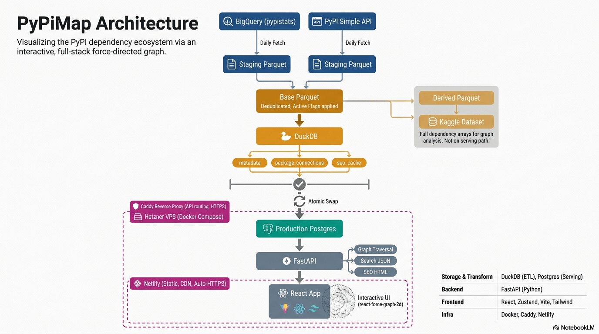

# PyPiMap

**An interactive map of the Python package dependency ecosystem.**

🔗 [pypimap.com](https://pypimap.com)

---

## Architecture



---

## What is PyPiMap?

PyPiMap lets you explore the Python package ecosystem on PyPI as a live, interactive graph. Search any package and see its full dependency network - what it depends on (needs), and what depends on it (feeds) - rendered as an explorable node graph you can click, drag, and expand.

Data is pulled from the official PyPI registry and refreshed daily via an automated pipeline.

## Features

- **Interactive dependency graph**: explore upstream (parent) and downstream (child) dependencies visually
- **Core vs. non-core distinction**: toggle whether to show optional/non-core dependencies
- **Expand in place**: click any node to reveal more of its own dependency chain without losing your current view
- **Recenter / focus**: double-click any node to make it the new root and explore from there
- **Cluster batching**: large dependency sets are paginated into "show more" clusters instead of dumping hundreds of nodes at once
- **Daily-updated data**: an automated ETL pipeline keeps package metadata and dependency graphs current

## Tech Stack

**Frontend:** React, Vite, Tailwind CSS, Zustand, react-force-graph-2d
**Backend:** FastAPI, PostgreSQL (hosted on Neon)
**Pipeline:** DuckDB-based daily ETL, orchestrated via GitHub Actions

## Data Sources & Attribution

PyPiMap is built on top of:
- [PyPIStats](https://pypistats.org) using Google BigQuery public dataset for packages' information.    
- [PyPI](https://pypi.org) using PyPI Simple API.

> Note: data in this repo may be outdated, for the latest daily-refreshed dataset, use the [Kaggle dataset](https://www.kaggle.com/datasets/naelaqel/pypi-daily-metadata-and-analytics-base-dataset/data).

## Getting Started

```bash
    >> git clone https://github.com/naelaqel/pypimap.git
    >> cd pypimap
    >> docker-compose up --build
```

Then open `http://localhost:3000` in your browser.

For local frontend development with hot-reload, see the [Local Frontend Development](./CONTRIBUTING.md#local-frontend-development-hot-reload) section in CONTRIBUTING.md.

See [CONTRIBUTING.md](./CONTRIBUTING.md) for full development setup and contribution guidelines.

## Contributing

Contributions are welcome! Please read [CONTRIBUTING.md](./CONTRIBUTING.md) before submitting a pull request, in short: fork the repo, branch from `dev`, and open your PR against `dev`.

## License

This project is licensed under the [MIT License](./LICENSE).

## Author

Built and maintained by **[Nael Aqel](https://naelaqel.com)**.

[GitHub](https://github.com/naelaqel) · [LinkedIn](https://www.linkedin.com/in/naelaqel1) · [Kaggle](https://www.kaggle.com/naelaqel) · [Website](https://naelaqel.com)

## Support

If you find PyPiMap useful, consider supporting its development and hosting costs:

[Support via PayPal](https://paypal.me/naelaqel90)