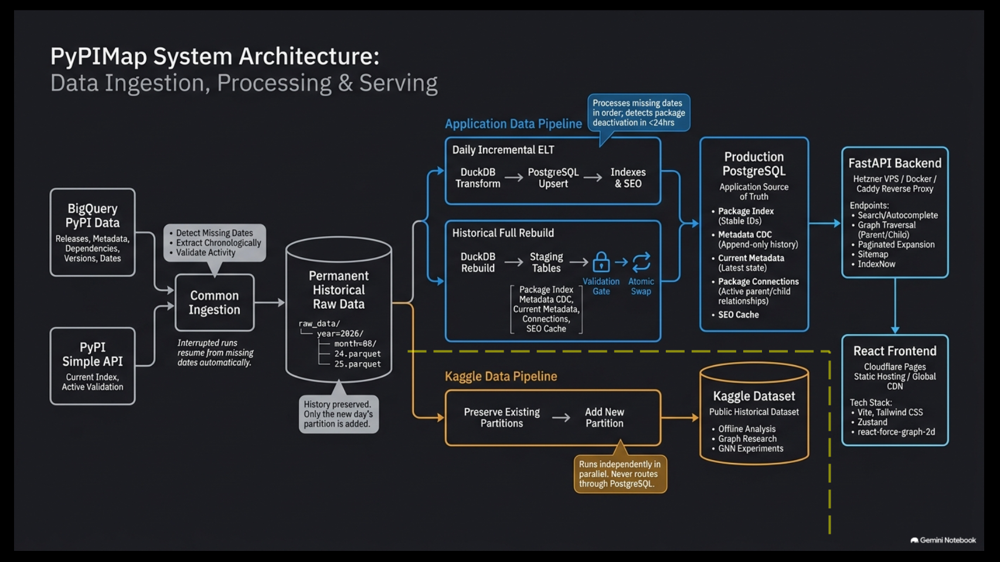

# PyPiMap

**An interactive map of the Python package dependency ecosystem.**

🔗 [pypimap.com](https://pypimap.com)

---

## Architecture



---

## What is PyPiMap?

PyPiMap lets you explore the Python package ecosystem on PyPI as an interactive dependency graph.    

Search for a package and explore what it depends on, what packages depend on it, how packages are connected throughout the ecosystem, and package metadata and ecosystem metrics.    

The graph can be clicked, dragged, expanded, and recentered to explore different parts of the dependency network.    

PyPiMap's data is refreshed daily through an automated ETL pipeline.

## Features

- **Interactive dependency graph**: explore upstream and downstream package relationships visually
- **Dependencies and dependents**: see what a package needs and what packages rely on it
- **Core vs. non-core dependencies**: toggle whether optional/non-core dependencies are included
- **Expand in place**: explore a node's dependency network without losing the current graph
- **Recenter / focus**: double-click a node to make it the new focus and explore from there
- **Cluster batching**: large dependency sets are grouped into "show more" clusters instead of displaying hundreds of nodes at once
- **Package information**: inspect package metadata and ecosystem-related metrics
- **Daily-updated data**: package and dependency data is refreshed through an automated ETL pipeline

## Tech Stack

**Frontend:** React, Vite, Tailwind CSS, Zustand, react-force-graph-2d
**Backend:** FastAPI, PostgreSQL    
**Pipeline:** DuckDB and PostgreSQL-based ETL pipeline, orchestrated through scheduled jobs


## Data Pipeline

PyPiMap uses an automated data pipeline to collect, process, and publish package ecosystem data.

At a high level:

```text
PyPIStats / PyPI
       ↓
Daily ETL
       ↓
Generated Parquet data
       ↓
PostgreSQL
       ↓
PyPiMap API
       ↓
Interactive frontend
```

The ETL process generates updated Parquet files daily. The latest generated files are published to the [`daily_parquet_after_etl`](https://github.com/NaelAqel/PyPIMap/tree/daily_parquet_after_etl) branch.


The `daily_parquet_after_etl` branch contains the latest Parquet files generated by the daily ETL pipeline. It is intentionally separate from the application's development and release branches and is updated as new ETL runs complete.

The [PyPiMap Kaggle dataset](https://www.kaggle.com/datasets/naelaqel/pypi-daily-metadata-and-analytics-base-dataset/data) is generated daily from the latest Parquet files pulled from this branch. It contains the full raw Parquet data as well as processed datasets designed for analysis and graph/ML use cases.

The generated data may be periodically promoted into the application as part of the normal development/release process.


## Data Sources & Attribution

PyPiMap is built on top of:
- [PyPIStats](https://pypistats.org) distribution metdata from the Google BigQuery public dataset.    
- [PyPI](https://pypi.org) using PyPI Simple API for validating active packages.

> **Note:** Data stored in this repository may not represent the latest daily dataset. The [`daily_parquet_after_etl`](https://github.com/NaelAqel/PyPIMap/tree/daily_parquet_after_etl) branch contains the latest ETL-generated Parquet files. The [PyPiMap Kaggle dataset](https://www.kaggle.com/datasets/naelaqel/pypi-daily-metadata-and-analytics-base-dataset/data) is generated daily from these files and provides both the full raw data and processed datasets for analysis and graph/ML use cases.

## Getting Started

```bash
  git clone https://github.com/naelaqel/pypimap.git
  cd pypimap
  docker-compose up --build
```

Then open `http://localhost:3000` in your browser.

For local frontend development with hot-reload, see the [Local Frontend Development](./CONTRIBUTING.md#local-frontend-development-hot-reload) section in CONTRIBUTING.md.

See [CONTRIBUTING.md](./CONTRIBUTING.md) for full development setup and contribution guidelines.


## Environment Configuration

PyPiMap uses environment variables for database, API, frontend, pipeline, and
external service configuration.

For local development, copy the example environment file and adjust the values
as needed:

```bash
  cp .env.example .env
```

The `.env.example` file documents the available configuration variables,
including:

- PostgreSQL connection and credential settings
- Backend and frontend ports
- Allowed CORS origins
- Frontend API URL
- Google Cloud credentials for BigQuery access
- IndexNow configuration
- GitHub App credentials used by the ETL pipeline

Some settings are only required when running specific parts of the pipeline
or connecting to external services. For a basic local application setup, use
the local PostgreSQL and API/frontend defaults provided in `.env.example`.


## Project Structure

```text
backend/        FastAPI backend and API
frontend/       React frontend
pipeline/       ETL pipeline and database loading
```

The project is divided into three main parts:

- **Frontend** the interactive PyPiMap web application
- **Backend** API and database access
- **Pipeline** data extraction, transformation, and loading


## API

The backend provides API endpoints for package search, package information, dependency relationships, and graph data.

The interactive API documentation is available when running the backend locally through FastAPI's generated API documentation.


## Data Freshness

PyPiMap's data is refreshed daily through the automated ETL pipeline.

Because the pipeline runs periodically, the information shown on PyPiMap may not immediately reflect changes that were made on PyPI.

The latest generated dataset is published to the [`daily_parquet_after_etl`](https://github.com/NaelAqel/PyPIMap/tree/daily_parquet_after_etl) branch and synchronized with the [Kaggle dataset](https://www.kaggle.com/datasets/naelaqel/pypi-daily-metadata-and-analytics-base-dataset/data).


## Contributing

Contributions are welcome.

The development workflow is:

```text
feature/fix branch
        ↓
       dev
        ↓
     release
        ↓
      main
```

- Create feature and fix branches from `dev`.
- Open pull requests against `dev`.
- `dev` is the main integration/development branch.
- `main` contains stable released versions.
- `daily_parquet_after_etl` is reserved for generated ETL data and is not part of the normal feature/fix workflow.

See [`CONTRIBUTING.md`](./CONTRIBUTING.md) for the full development setup, branching strategy, and contribution guidelines.

## License

This project is licensed under the [MIT License](./LICENSE).

## Author

Built and maintained by **[Nael Aqel](https://naelaqel.com)**.

[GitHub](https://github.com/naelaqel) · [LinkedIn](https://www.linkedin.com/in/naelaqel1) · [Kaggle](https://www.kaggle.com/naelaqel) · [Website](https://naelaqel.com)

## Support

If you find PyPiMap useful, consider supporting its development and hosting costs:

[Support via PayPal](https://paypal.me/naelaqel90)