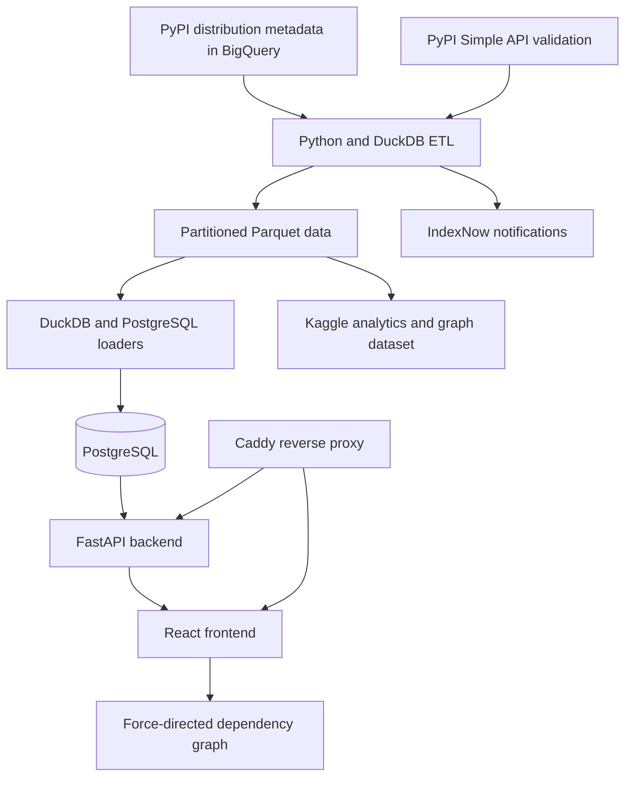
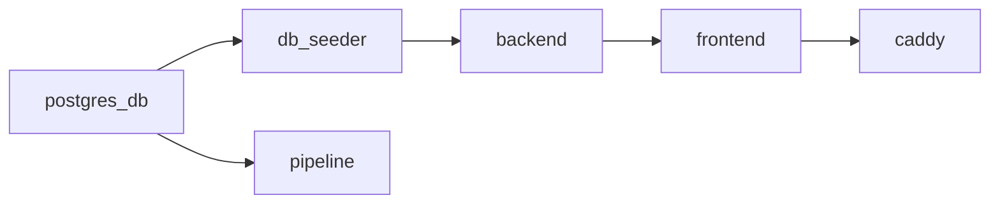
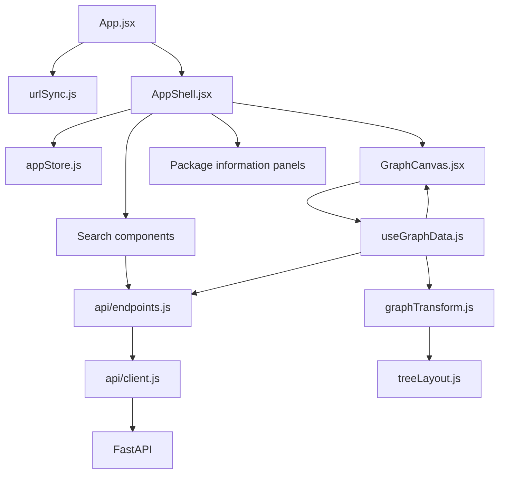

# PyPIMap project map

This document records the stable architecture, subsystem boundaries, and navigation entry points for PyPIMap. Runtime structure, dependency relationships, hotspots, and change impact should be regenerated with Ripwire rather than copied here because those facts change with the codebase.

## Purpose

PyPIMap is an interactive explorer for the Python package dependency ecosystem. It lets users search for a package, inspect package metadata, visualize packages that depend on it and packages it depends on, expand either side of the graph, and distinguish core from optional dependencies.

The application has four main subsystems:

| Subsystem | Responsibility | Main locations |
|---|---|---|
| Frontend | Search, application state, graph transformation, visualization, and package details | `frontend/src/` |
| Backend | FastAPI endpoints, PostgreSQL queries, graph traversal, SEO pages, and sitemaps | `backend/main.py` |
| Pipeline | BigQuery extraction, Parquet generation, DuckDB transformations, and PostgreSQL loading | `pipeline/` |
| Infrastructure | Container startup, persistent volumes, public routing, and HTTPS | `docker-compose.yml`, `Caddyfile` |

## Engineering perspective

The primary maintainer is a data analytics engineer. The pipeline and SQL layers therefore contain much of the project's domain expertise and deliberate optimization work. They should be treated as core product infrastructure rather than incidental data-loading scripts.

The pipeline is designed to perform expensive work once—BigQuery extraction, cleaning, PEP 503 normalization, active-package verification, historical aggregation, and dependency graph compilation—so the web application and external analytics consumers can use compact, precomputed outputs. Changes should preserve incremental processing, columnar Parquet operations, set-based SQL, and reusable graph vectors unless measurements justify a different design.

## End-to-end architecture



The normal data flow is:

1. The pipeline extracts PyPI distribution metadata from BigQuery.
2. Package activity is validated or enriched using PyPI data.
3. Daily data is written as partitioned Parquet files.
4. DuckDB transforms the Parquet data and loads PostgreSQL.
5. PostgreSQL stores current metadata, history, precomputed relationships, metrics, and SEO content.
6. FastAPI queries PostgreSQL and exposes package, search, and graph endpoints.
7. The React frontend transforms API responses into an interactive graph.
8. The same generated Parquet history is published for analytics, data-science, machine-learning, and graph-engineering use cases.

## Kaggle dataset and downstream analytics

The pipeline also supplies [PyPI Daily Package Profiles & Analytics Graph](https://www.kaggle.com/datasets/naelaqel/pypi-daily-metadata-and-analytics-base-dataset), a CC BY 4.0 dataset refreshed daily from the latest generated data on the `daily_parquet_after_etl` branch.

This is not merely an export of the web application's database. It exposes two complementary products:

- A historical raw-data layer in Hive-style partitions at `raw_data/year={year}/month={month}/{day}.parquet`.
- An analyst-friendly package-level snapshot, `pypi_package_snapshot.parquet`, generated with DuckDB from the accumulated raw history.

The upstream PyPIMap ETL performs the expensive collection and preprocessing: BigQuery queries, string cleaning, PEP 503 name normalization, live PyPI checks, and raw Parquet generation. The Kaggle notebook consumes those outputs and performs the final snapshot transformation.

The snapshot is designed to avoid repeated structural joins and graph-compilation work. In addition to package metadata and lifecycle fields, it includes:

- Stable package IDs and normalized names.
- Release counts and first/last upload timestamps.
- Active-package status.
- `importance_score`, defined as core children plus `0.3 ×` non-core children.
- Core/non-core parent and child counts.
- Precomputed parent and child ID arrays suitable for Pandas, Polars, graph databases, graph algorithms, and machine-learning workflows.

Primary downstream uses include package lifecycle and health analysis, ecosystem popularity and author analysis, dependency subgraph reconstruction, graph feature engineering, and graph/ML experimentation. The production web application and the public analytics dataset are therefore two consumers of the same optimized data foundation.

## Deployment and startup

`docker-compose.yml` defines the service topology:



- `postgres_db` runs PostgreSQL and stores data in the persistent `pg_data` volume.
- `db_seeder` runs `python -u -m pipeline.etl --seed-only` before the backend starts.
- `backend` serves FastAPI and mounts the built frontend distribution for package-specific SEO pages and static assets.
- `frontend` builds and serves the React/Vite application and shares its distribution through `frontend_dist`.
- `caddy` exposes HTTP/HTTPS and routes public traffic.
- `pipeline` runs the recurring ETL workflow separately from initial database seeding.

`Caddyfile` divides public traffic as follows:

- `pypimap.com/package/*`, sitemap routes, crawler files, and the IndexNow verification file go to FastAPI.
- Other `pypimap.com` requests go to the frontend.
- All `api.pypimap.com` requests go to FastAPI.

## Pipeline

### Entry point

`pipeline/etl.py` is the pipeline coordinator. Its `main()` function:

1. Extracts source data through `pipeline/scripts/etl_to_raw_data.py`, unless running in seed-only mode.
2. Loads or migrates PostgreSQL through `pipeline/scripts/fill_pg.py`.
3. Propagates failures instead of silently completing an unsuccessful run.

### Extraction

`pipeline/scripts/etl_to_raw_data.py`:

- Determines which processing dates are missing.
- Executes `pipeline/sql/bigquery.sql` against the public PyPI distribution metadata dataset.
- Writes Zstandard-compressed Parquet data under `pipeline/staging/raw_data/year=YYYY/month=MM/DD.parquet`.
- Uses DuckDB and `pipeline/sql/merged_to_raw_data.sql` to produce the raw daily representation used by later loading stages.

### PostgreSQL loading

`pipeline/scripts/fill_pg.py` supports:

- Full table recreation and migration when schemas change.
- Incremental loading for selected processing dates.
- Recalculation of relationships for changed and affected packages.
- IndexNow submission for pages changed during the ETL run.

The SQL files under `pipeline/sql/` contain much of the pipeline's business logic. Ripwire does not structurally parse SQL in this repository, so pipeline changes require targeted SQL searches and reads in addition to the Python call graph.

### Core data model

The PostgreSQL model is created through `pipeline/sql/pg_create_tables.sql` and promoted from staging to production by migration SQL.

| Table | Responsibility |
|---|---|
| `pypi.indecies` | Stable numeric identity for normalized package names |
| `pypi.metadata_cdc` | Historical package metadata states |
| `pypi.metadata` | Current package metadata and ecosystem metrics |
| `pypi.package_connections` | Precomputed core/non-core parent and child IDs and counts |
| `pypi.seo_cache` | Package-specific SEO headers and active status |

`pypi.package_connections` denormalizes dependency relationships into arrays so graph endpoints can traverse precomputed IDs rather than repeatedly parsing requirement strings.

The spelling `indecies` is an existing schema identifier. Renaming it requires a deliberate database migration and coordinated SQL/backend changes.

## Backend

`backend/main.py` is the backend application and primary backend entry point. It currently combines application configuration, middleware, direct Psycopg database access, graph traversal, SEO rendering, sitemap generation, and static asset routes.

### Main endpoint groups

Package and discovery endpoints:

- `GET /` selects a random active package and redirects to it.
- `GET /last_update` reports the newest package data date.
- `GET /search?q=...` searches package names and authors.
- `GET /package/api/{name}` returns package metadata as JSON.

Graph endpoints:

- `GET /graph/{name}/parents` returns packages that depend on the focused package.
- `GET /graph/{name}/children` returns packages the focused package depends on.

Graph requests support bounded depth, node caps, offsets, and optional inclusion of non-core relationships. Offset-based requests power cluster pagination in the frontend.

Web and SEO endpoints:

- `GET /package/{name}` injects package-specific SEO markup into the built React HTML.
- Sitemap endpoints publish static and paginated package URLs.
- `robots.txt`, `ai.txt`, and `llms.txt` publish crawler and machine-readable guidance.
- Manifest and favicon endpoints serve files from the built frontend distribution.

The backend uses direct SQL and opens Psycopg connections in route handlers; it does not currently have an ORM or repository/service layer.

## Frontend

### Control flow



### Entry and shell

- `frontend/src/App.jsx` initializes URL synchronization and renders `AppShell`.
- `frontend/src/components/layout/AppShell.jsx` initializes the default package, loads the last-update date, handles the guide page, and composes the graph, search, package information, notifications, and onboarding UI.
- Routing is based primarily on browser location/history rather than a full client-side router.

### Shared state

`frontend/src/store/appStore.js` owns shared state and actions for:

- Focused package identity.
- Breadcrumb navigation.
- Core/non-core display mode.
- Errors and global notifications.
- Initial/default package selection.

Because many frontend components depend on this store, changes to its state or action contracts should be checked for broad impact.

### API boundary

- `frontend/src/api/client.js` centralizes fetch behavior and network/not-found errors.
- `frontend/src/api/endpoints.js` exposes named operations for search, package details, last-update data, parent/child graph requests, and paginated graph slices.

### Graph data

`frontend/src/hooks/useGraphData.js` is the graph data controller:

1. It fetches parent and child graphs concurrently when the focused package changes.
2. It combines responses through `transformInitialGraph()`.
3. It stores the merged graph locally and enforces a total-node limit.
4. It expands package nodes one direction at a time.
5. It replaces cluster nodes with offset-based result slices.
6. It filters the loaded graph to core-only reachable nodes when the non-core toggle is disabled.

Initial graph requests include non-core relationships. The core-only UI mode is derived client-side from the loaded graph.

### Transformation and layout

- `frontend/src/utils/graphTransform.js` handles deduplication, styling, cluster construction, initial merging, and expansion merging.
- `frontend/src/utils/treeLayout.js` calculates initial outward placement and expansion branch positions.

These files form the boundary between API response data and the visual graph model.

### Rendering and interaction

`frontend/src/components/graph/GraphCanvas.jsx` renders the graph with `react-force-graph-2d` and implements:

- Single-click expansion.
- Double-click refocusing.
- Cluster pagination.
- Core/non-core visibility.
- Hover highlighting.
- Animated node appearance.
- Subtree dragging and pinning.
- Camera fitting and reset.

`GraphCanvas.jsx` and `useGraphData.js` are the main places to inspect for user-visible graph behavior.

## Navigation guide

Start with these files according to the task:

| Task | Start here |
|---|---|
| API route or graph traversal | `backend/main.py` |
| ETL orchestration | `pipeline/etl.py` |
| BigQuery-to-Parquet extraction | `pipeline/scripts/etl_to_raw_data.py` |
| PostgreSQL loading or migrations | `pipeline/scripts/fill_pg.py`, then the relevant `pipeline/sql/` file |
| Database schema | `pipeline/sql/pg_create_tables.sql` |
| Shared frontend state | `frontend/src/store/appStore.js` |
| Frontend API calls | `frontend/src/api/endpoints.js`, `frontend/src/api/client.js` |
| Graph loading or expansion | `frontend/src/hooks/useGraphData.js` |
| Graph data transformation | `frontend/src/utils/graphTransform.js` |
| Graph layout | `frontend/src/utils/treeLayout.js` |
| Graph interaction or drawing | `frontend/src/components/graph/GraphCanvas.jsx` |
| Runtime topology | `docker-compose.yml`, `Caddyfile` |

## Ripwire workflow

For a new task, retrieve durable project knowledge before mapping current code:

```bash
ripwire . --recall="<task>"
ripwire . --pack-task="<task>" --token-budget=10000
```

Before adding a function or class, look for the repository's established pattern:

```bash
ripwire . --exemplar="<subtask>"
```

After editing an important symbol, check its contract and callers:

```bash
ripwire . --edit-check=<symbol>
```

Before finishing, inspect change impact and quality regressions:

```bash
ripwire . --situ
ripwire . --quality-delta
```

Use `.ripwire_notes` for non-obvious symbol- or file-specific invariants. Do not store generated reports, hotspot values, line numbers, symbol counts, or module IDs in this document; regenerate those from the current tree.
